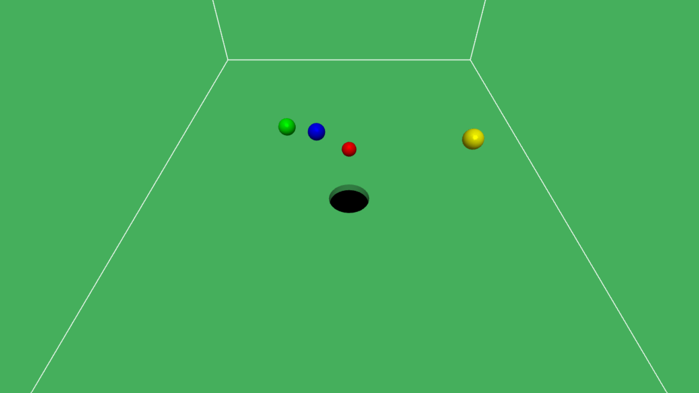

# Hole-in-the-Ground

  

A fun 3D physics video game inspired by the 2018 indie game **Donut County** by Ben Esposito.  
In this game, you control a magical hole in the ground that grows as objects fall into it, eventually swallowing larger objects and buildings.

---

## 🎮 Game Controls

- **Move the Hole:**  
  - WASD keys or arrow keys  
  - Mouse / touch input  
- **Objective:** Swallow smaller objects first to grow large enough to capture bigger ones.

---

## ✨ Features

1. **Hole Control and Boundaries**  
   - Hole moves on X-Z plane  
   - Boundary checks prevent leaving the playable area

2. **Physics Simulation**  
   - Moving spheres with simplified rigid body dynamics  
   - Gravity causes spheres to fall naturally  
   - Friction applied on bounces  

3. **Collision Handling**  
   - Boundary collisions: spheres bounce back without penetrating walls  
   - Sphere-sphere collisions: resolved using collision normals and relative velocities  

4. **Custom Levels**  
   - At least 8 spheres of varying sizes per stage  
   - Winning requires strategic capture of smaller spheres first  
   - Supports creative arrangements (e.g., Rube Goldberg style puzzles)  

5. **Official Build for Deployment**  
   - TypeScript code compiled and bundled into a `dist` folder  
   - Ready for deployment on GitHub Pages or any static hosting service  

---

## ⚙️ Build and Run Locally

1. Install dependencies:
```bash
npm install
